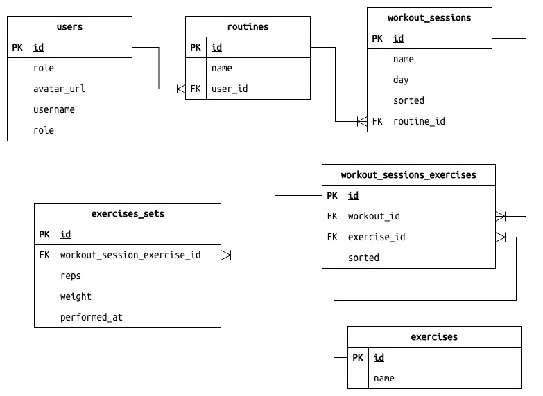

# StrengthUp 🏋️‍♀️

StreghthUp, una aplicación para registrar tus entrenamientos del gimnasio de manera sencilla y eficaz, con la que podrás ver tus avances a lo largo del tiempo mediante un indicadores.

## Stack


## Modelo relacional de base de datos 📏



## Estructura del proyecto 📂

```bash
app
├── (auth)
│   └── signup.tsx
├── +not-found.tsx
├── _layout.tsx
├── hour-training.tsx
├── index.tsx
├── list-exercises.tsx
├── personal
│   ├── (routines)
│   │   ├── _layout.tsx
│   │   ├── exercise
│   │   │   └── [...exercise].tsx
│   │   ├── history
│   │   │   └── [history].tsx
│   │   ├── index.tsx
│   │   ├── new-routine.tsx
│   │   ├── new-workout-session.tsx
│   │   ├── routine
│   │   │   └── [...routine].tsx
│   │   └── workout
│   │       └── [...workout].tsx
│   ├── (settings)
│   │   ├── _layout.tsx
│   │   ├── index.tsx
│   │   ├── profile.tsx
│   │   └── stateSub.tsx
│   └── _layout.tsx
└── scanner-routine.tsx
```

## Instalación para desarrollo 🚀

1. Instalar dependencias

   ```bash
   npm install
   ```

2. Compilación de desarrollo local (local development build)

   ```bash
    npx expo run:android
   ```

   Para correr la app en android, deberá tener el android studio

- [Android emulator](https://docs.expo.dev/workflow/android-studio-emulator/)
- [iOS simulator](https://docs.expo.dev/workflow/ios-simulator/)
- [Expo Go](https://expo.dev/go)
