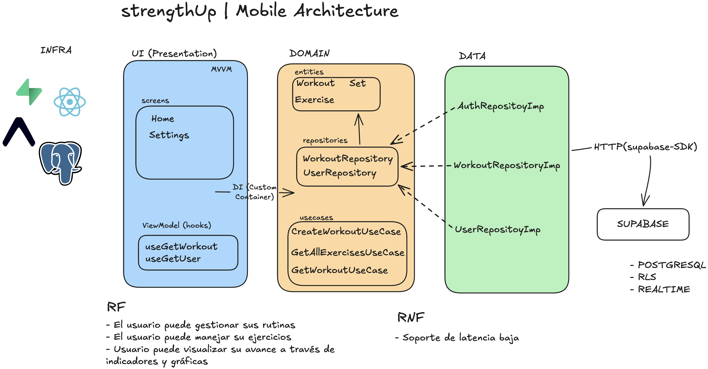
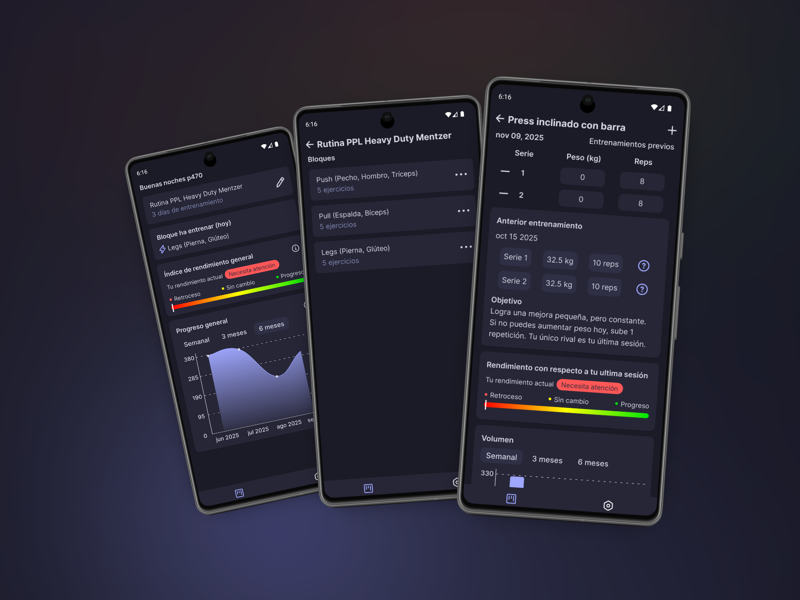
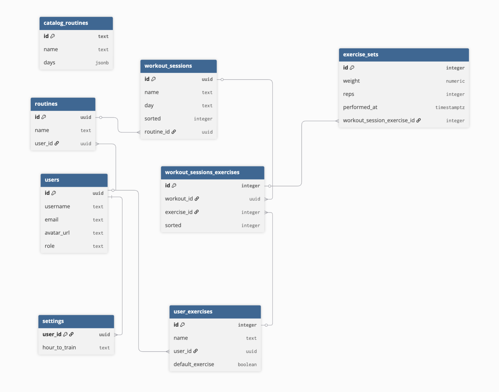

# StrengthUp

**StrengthUp** es una aplicacion movil de seguimiento de fitness creada con React Native y Expo. Ayuda a los asistentes al gimnasio a registrar sus entrenamientos, dar seguimiento a su progreso a lo largo del tiempo y mantenerse motivados con recomendaciones personalizadas, todo en una experiencia movil nativa y limpia.

Ya seas un principiante que busca construir consistencia o un levantador experimentado analizando tendencias de rendimiento, StrengthUp proporciona las herramientas para gestionar rutinas, registrar series, visualizar el progreso y recibir recomendaciones de entrenamiento impulsadas por IA.

## Arquitectura



Se aplicó Clean Architecture(basado en la guía de arquitectura de Android de Google), el proyecto sigue una organizacón Feature First, cada feature conteniendo las tres capas, Presentación, Dominio, y Datos:

- Presentation: Views (Components, Screens) + ViewModel
- Domain: Entidades (Workout, Sets, Block, User), interfaces de repositories y casos de uso
- Data: Implementación de repositorios, uso de supabase como backend

Porque de esta manera respeta la regla de depencia, esto hace que el proyecto sea mantenible, testeable y escalable a largo del tiempo. Además favorece que la capa de datos no dependa directamente de Supabase, es decir tiene bajo acoplamiento.

## Funcionalidades

### Gestion de Rutinas y Entrenamientos

- Crear y organizar rutinas de entrenamiento con multiples sesiones (ej. Push A, Pull B, Dia de Pierna)
- Asignar sesiones a dias especificos de la semana
- Reordenar sesiones y ejercicios mediante arrastrar y soltar
- Importar rutinas preconstruidas desde un catalogo mediante codigo o escaner QR
- Constructor de rutinas con IA (Premium): responde unas preguntas y obtienes un plan semanal estructurado

### Registro de Entrenamientos

- Registrar series con peso (kg) y repeticiones para cada ejercicio
- Edicion en linea de series registradas durante y despues de los entrenamientos
- Consultar datos de entrenamientos anteriores para comparar rendimiento
- Validacion en tiempo real y guardado por lotes

### Analiticas de Progreso

- Indice de rendimiento semanal que compara el volumen de entrenamiento actual vs. anterior
- Graficos de lineas interactivos que muestran tendencias de volumen a lo largo del tiempo (1 semana, 3 meses, 6 meses)
- Comparaciones de rendimiento por ejercicio contra la sesion anterior

### Entrenador IA (Premium)

- Asistente de entrenamiento impulsado por OpenAI ("Coach Atlas") que analiza tus ultimos 15 dias de datos de entrenamiento
- Proporciona recomendaciones personalizadas sobre gestion de fatiga, progresion y deteccion de estancamiento
- Entregado en formato Markdown dentro de la aplicacion

### Autenticacion y Perfiles

- Inicio de sesion con Google y correo electronico/contraseña mediante Supabase
- Perfiles de usuario editables con avatares
- Sesiones persistentes al reiniciar la aplicacion

### Monetizacion por Suscripcion

- Integracion con RevenueCat para compras dentro de la aplicacion
- Nivel Premium que desbloquea funciones de IA y herramientas avanzadas
- Pantalla de estado de suscripcion con detalles de vencimiento y opcion de restaurar compras

### Notificaciones

- Recordatorios diarios de entrenamiento programados a la hora preferida del usuario
- Mensajes motivacionales vespertinos con frases en espanol
- Canal de notificaciones personalizado con alta prioridad y sonido

### Temas y Experiencia de Usuario

- Soporte completo de modo oscuro/claro
- Retroalimentacion haptica en las interacciones
- Estados de carga con esqueleto
- Barra de pestañas animada personalizada
- Interfaz de usuario en espanol (locale MX/ES)

---

## Stack Tecnologico

| Capa                    | Tecnologia                                    |
| ----------------------- | --------------------------------------------- |
| **Framework**           | React Native 0.81 + Expo 54                   |
| **Navegacion**          | Expo Router (enrutamiento basado en archivos) |
| **Backend**             | Supabase (Auth, PostgreSQL, Realtime)         |
| **Estado**              | Zustand                                       |
| **Pagos**               | RevenueCat                                    |
| **IA**                  | OpenAI GPT-4o-mini                            |
| **Graficos**            | react-native-gifted-charts                    |
| **Arrastrar y Soltar**  | react-native-draggable-flatlist               |
| **Notificaciones**      | expo-notifications                            |
| **QR/Codigo de Barras** | expo-camera                                   |
| **Tipografia**          | Inter (Google Fonts)                          |
| **Fechas**              | date-fns (locale es)                          |
| **Animaciones**         | react-native-reanimated                       |
| **Almacenamiento**      | expo-secure-store, AsyncStorage               |


---

## Capturas de Pantalla

| Login                                         | Dashboard                        |
| --------------------------------------------- | -------------------------------- |
|  |  |

---

## Esquema de Base de Datos



La aplicacion utiliza **Supabase** (PostgreSQL) como base de datos principal. Las tablas clave incluyen:

- **users** — perfiles de usuario y datos de autenticacion
- **routines** — contenedores de rutinas de entrenamiento
- **workout_sessions** — dia/bloque individual dentro de una rutina
- **workout_sessions_exercises** — tabla de union que vincula ejercicios con sesiones
- **exercise_sets** — series registradas con peso, repeticiones y marcas de tiempo
- **user_exercises** — ejercicios personalizados creados por los usuarios
- **catalog_routines** — rutinas preconstruidas disponibles para importar
- **settings** — preferencias del usuario (ej. hora de entrenamiento)

---

## Estructura del Proyecto

```
app/
├── (auth)/              # Pantallas de autenticacion (login, registro)
├── (personal)/
│   ├── (routines)/      # Gestion de rutinas, registro de entrenamientos, historial
│   └── (settings)/      # Perfil, preferencias, suscripcion
├── _layout.tsx          # Layout raiz (fuentes, tema, inicio de sesion)
├── index.tsx            # Punto de entrada (redireccion de autenticacion)
├── list-exercises.tsx   # Selector de ejercicios
├── hour-training.tsx    # Selector de hora de entrenamiento
└── scanner-routine.tsx  # Escaner QR de rutinas
```

---

## Primeros Pasos

### Requisitos Previos

- Node.js
- Android Studio (para emulador Android) o Xcode (para simulador iOS)
- Expo CLI

### Instalacion

```bash
# Instalar dependencias
npm install

# Iniciar la compilacion de desarrollo en Android
npx expo run:android

# O para iOS
npx expo run:ios
```

### Guias de Emuladores

- [Emulador de Android Studio](https://docs.expo.dev/workflow/android-studio-emulator/)
- [Simulador de iOS](https://docs.expo.dev/workflow/ios-simulator/)
- [Expo Go](https://expo.dev/go)

---

## Licencia

Privado — Todos los derechos reservados.
