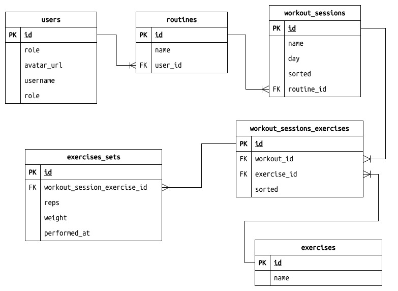

# StrengthUp 🏋️‍♀️

**StrengthUp** is a mobile fitness tracking application built with React Native and Expo. It helps gym-goers log their workouts, track progress over time, and stay motivated with personalized insights — all in a clean, native mobile experience.

Whether you're a beginner looking to build consistency or an experienced lifter analyzing performance trends, StrengthUp provides the tools to manage routines, record sets, visualize progress, and receive AI-powered coaching recommendations.

---

## ✨ Features

### 📋 Routine & Workout Management
- Create and organize training routines with multiple workout sessions (e.g., Push A, Pull B, Leg Day)
- Assign sessions to specific days of the week
- Drag-and-drop reordering of both sessions and exercises
- Import pre-built routines from a catalog via code or QR code scanner
- AI-generated routine builder (Premium) — answer a few questions and get a structured weekly plan

### 💪 Workout Tracking
- Log sets with weight (kg) and repetitions for each exercise
- Inline editing of logged sets during and after workouts
- Reference previous workout data to compare performance
- Real-time validation and batch saving

### 📈 Progress Analytics
- Weekly performance index comparing current vs. previous training volume
- Interactive line charts showing volume trends over time (1 week, 3 months, 6 months)
- Per-exercise performance comparisons against last session

### 🤖 AI Coach (Premium)
- OpenAI-powered coaching assistant ("Coach Atlas") analyzes your last 15 days of training data
- Provides personalized recommendations on fatigue management, progression, and stagnation detection
- Delivered in Markdown format within the app

### 🔐 Authentication & Profiles
- Google Sign-In and email/password authentication via Supabase
- Editable user profiles with avatars
- Persistent sessions across app restarts

### 💳 Subscription Monetization
- RevenueCat integration for in-app purchases
- Premium tier unlocking AI features and advanced tools
- Subscription status screen with expiration details and restore purchases option

### 🔔 Notifications
- Daily workout reminders scheduled at the user's preferred training time
- Motivational evening messages with curated Spanish phrases
- Custom notification channel with high priority and sound

### 🌗 Theming & UX
- Full dark/light mode support
- Haptic feedback on interactions
- Skeleton loading states
- Custom animated tab bar
- Spanish-first UI (MX/ES locale)

---

## 🛠 Tech Stack

| Layer | Technology |
|-------|-----------|
| **Framework** | React Native 0.81 + Expo 54 |
| **Navigation** | Expo Router (file-based routing) |
| **Backend** | Supabase (Auth, PostgreSQL, Realtime) |
| **State Management** | Zustand |
| **Payments** | RevenueCat |
| **AI** | OpenAI GPT-4o-mini |
| **Charts** | react-native-gifted-charts |
| **Drag & Drop** | react-native-draggable-flatlist |
| **Notifications** | expo-notifications |
| **QR/Barcode** | expo-camera |
| **Typography** | Inter (Google Fonts) |
| **Dates** | date-fns (es locale) |
| **Animations** | react-native-reanimated |
| **Storage** | expo-secure-store, AsyncStorage |


---

## 📱 Screenshots

| Login | Dashboard |
|-------|-----------|
|  |  |

---

## 🗄 Database Schema



The application uses **Supabase** (PostgreSQL) as its primary database. Key tables include:

- **users** — user profiles and authentication data
- **routines** — training routine containers
- **workout_sessions** — individual day/block within a routine
- **workout_sessions_exercises** — join table linking exercises to sessions
- **exercise_sets** — logged sets with weight, reps, and timestamps
- **user_exercises** — custom exercises created by users
- **catalog_routines** — pre-built routines available for import
- **settings** — user preferences (e.g., training time)

---

## 📁 Project Structure

```
app/
├── (auth)/              # Authentication screens (login, signup)
├── (personal)/
│   ├── (routines)/      # Routine management, workout logging, history
│   └── (settings)/      # Profile, preferences, subscription
├── _layout.tsx          # Root layout (fonts, theme, session init)
├── index.tsx            # Entry point (auth redirect)
├── list-exercises.tsx   # Exercise picker
├── hour-training.tsx    # Training time selector
└── scanner-routine.tsx  # QR code routine scanner
```

---

## 🚀 Getting Started

### Prerequisites

- Node.js
- Android Studio (for Android emulator) or Xcode (for iOS simulator)
- Expo CLI

### Installation

```bash
# Install dependencies
npm install

# Start the Android development build
npx expo run:android

# Or for iOS
npx expo run:ios
```

### Emulator Guides

- [Android Studio Emulator](https://docs.expo.dev/workflow/android-studio-emulator/)
- [iOS Simulator](https://docs.expo.dev/workflow/ios-simulator/)
- [Expo Go](https://expo.dev/go)

---

## 📄 License

Private — All rights reserved.
